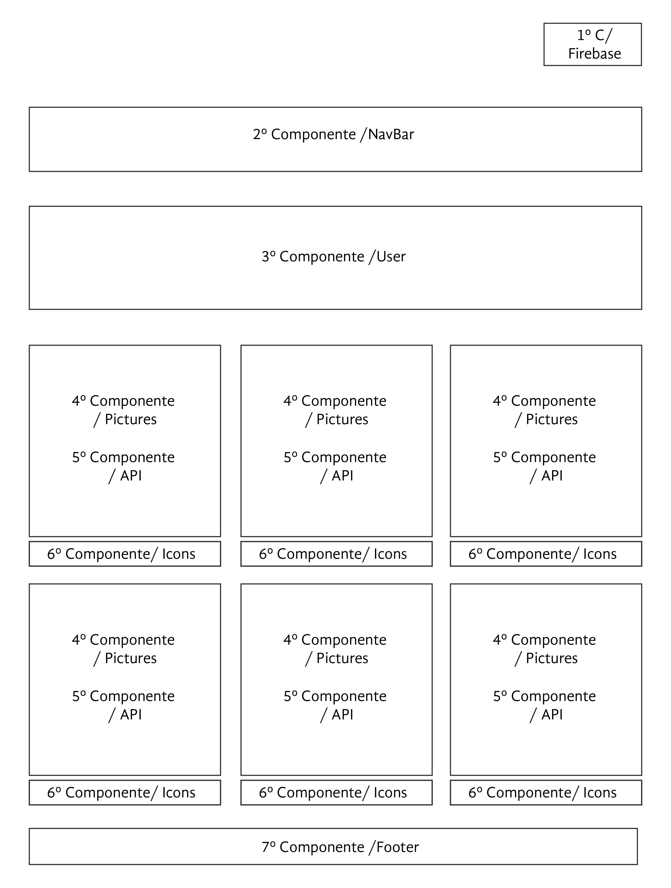

 

# Instagram React

Proyecto creado en React usando la API de Instagram

### Uso

***
Con el objetivo de construir una aplicación cuya experiencia fuese más fluida para los usuarios, integramos React como un recurso dinamico. Ésta en particular posee 5 componentes cuyas divisiones se aprecian en la fotografía de más abajo.

+ Descargar este repositorio
+ Posicionados en la Terminal escribir npm install, para  
  instalar las dependencias.
+ Escribir npm start para abrir en servidor local.
***

### Requerimientos Técnicos

El proyecto fue realizado con las siguientes dependencias npm:

##### Dependencias de Producción
  - "firebase": "^4.11.0",
  - "jquery": "^3.3.1",
  - "react": "^16.2.0",
  - "react-ajax": "^0.1.1",

  

